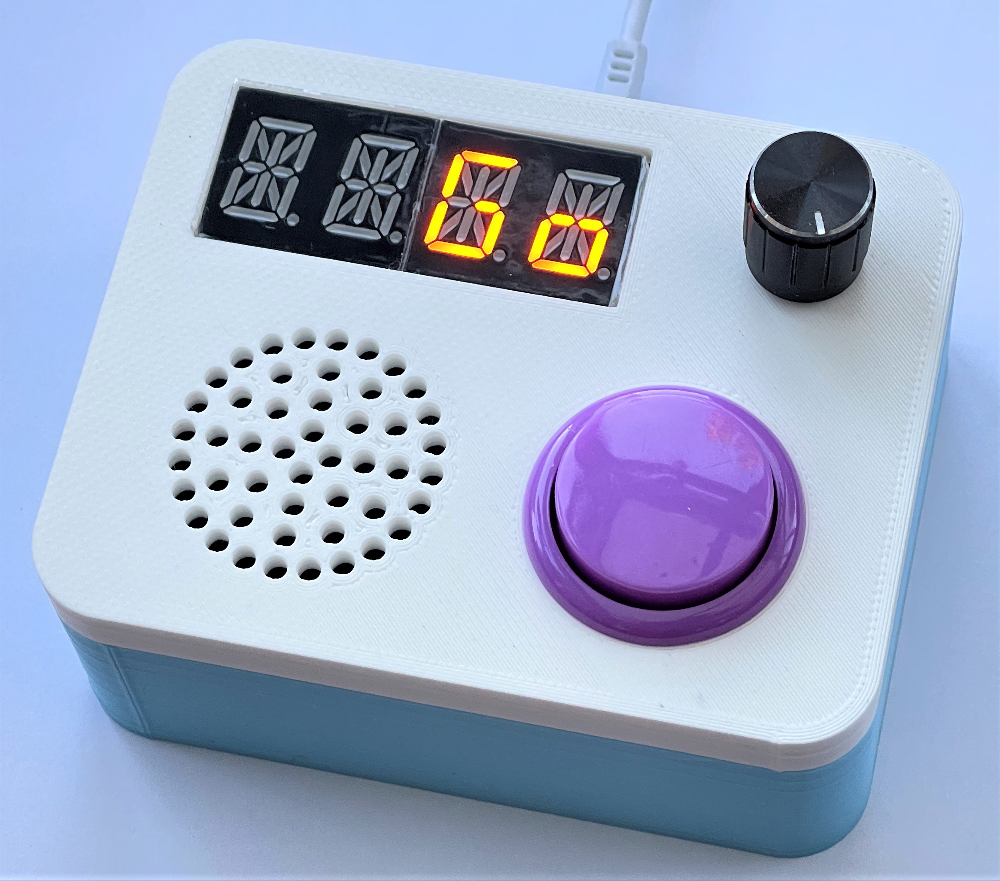
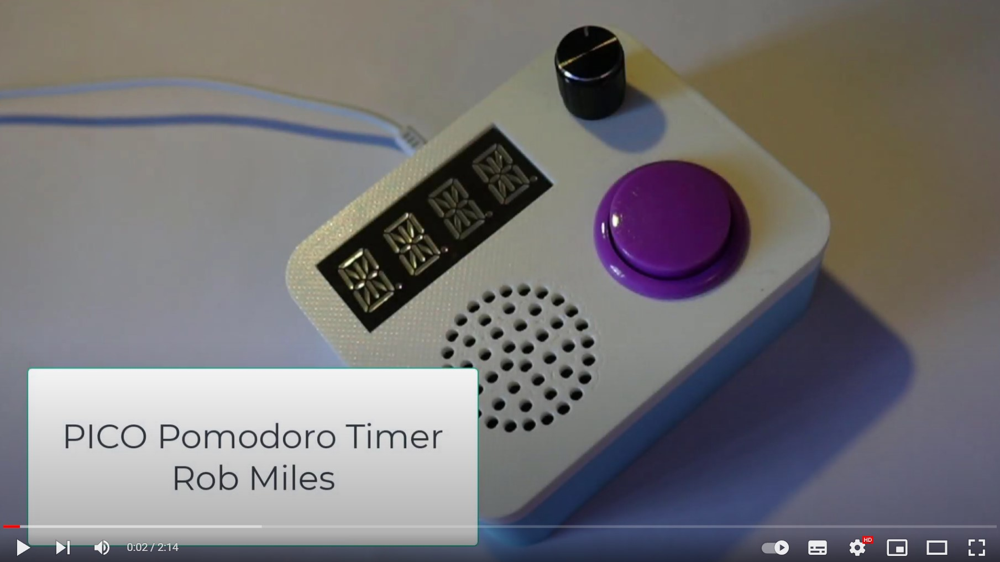
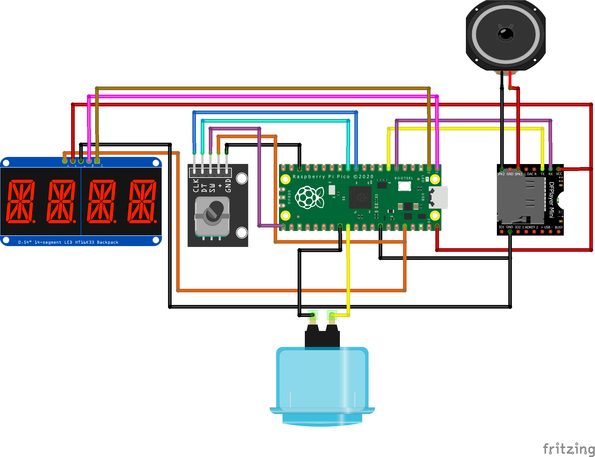

# PICO Talking Pomodoro

Designs and software for a PICO Talking Pomodoro presented in Hackspace magazine.

## Video

To find out more about the device click on the image above to see a short video.

## Using the Pomodoro
There are two controls on the Pomodoro. A knob (rotary encoder) you can turn to select settings and a big button you can press. You can also use the knob as a button by pressing it in. 

When you power up the device it says Hi and then displays "Set". Set the time by turning the knob to select the number of hours and minutes that you want the timer to run for. When you have selected the time, push in the knob or press the button. The screen will now display "Up". 

If you want the timer to count elapsed time push in the knob or press the button. If you want the timer to count down (and tell you how much time is left) turn the knob until "Down" is displayed. When you have selected the required direction, push in the knob or press the button. 

Now you select the feedback that you want. You can rotate the knob to select between "None", "Disp", "Five", "Ten" and "Rand":

* None - the time will not be displayed. The timer will play a chime when the time completes
* Disp - the time will be displayed but the timer will be silent.
* Five - the time will be displayed and the timer will announce the time every five minutes. 
* Ten - the time will be displayed and the timer will announce the time every Ten minutes. 
* Rand - - the time will be displayed and the timer will announce the time at random intervals.

When you have selected the feedback that you want, push in the knob or press the button. The timer will display GO, which means that it is ready to run. Now press the button or push in the knob to start the clock ticking. If you have selected a display you will see it on the screen. You will also hear time announcements if you have selected them. 
To check the time at any other point, press the button and the time will be announced and displayed, depending on what you have selected. 

To stop the timer early press in on the rotary control and select "Stop" from the menu that appears. If you select "Cont" the timer will continue.

## Hardware

You will need the following hardware items:

* A Raspberry Pi PICO
* A DFPlayer Mini MP3 player (search for "DFPlayer Mini") 
* A MicroSD card. This is perhaps the most expensive component. However, you don't need a very large one. The author used an 8 Gigabyte card that he received with a tiny camera many years ago.
* A four character alphanumeric display with an HT16K33 backpack. Search for "ht16k33 14 segment led". Make sure that you get the 14 segment device as this can display text.
* A large push button (preferably one with a nice colour)
* A rotary encoder (search for KY-040 encoder)
* A small speaker (You can get a very nice one from Pimoroni: https://shop.pimoroni.com/products/mini-speaker-4-3w)
* A micro-USB cable to link the PICO to the host
* Connecting wire (search for "30 AWG wire wrap") which needs a wire wrap tool (search for "wire wrap tool").
* A box. There is a 3D printable design, or you can put your timer in any box you fancy.
* Screws. You'll need some screws sized M2 4mm in length to fix things to the case (search for "laptop screws")
* Sticky fixer. The MP3 player does not have any fixing holes, so you must stick it inside the case using double sided tape or a “sticky fixer” pad.

## Sound files

The Sounds folder contains the MP3 samples used for the announcements. These must be copied onto a MicroSD card which is inserted into the DFPlayer. Note that they must be copied in order as the player ignores filenames and just uses the file position in the folder directory. If you copy all the files at once they may not be copied in the correct oder. The program FileCopier.py in the sounds folder can be used to copy the files one at a time into a card. 

## Program files

You can find the Circuit Python program in the code folder. Store this as code.py on your device so that it runs when it is powered up. Make sure you are using Version 7 of Circuit Python. 

## Case designs

There are 3D printable designs for the case in the case folder. The two parts are a friction fit.

## Lib

The timer uses a collection of Circuit Python library files that must be stored in the lib folder on your device. The lib folder contains all the requried files. Copy the contents into the lib folder on your device. 
